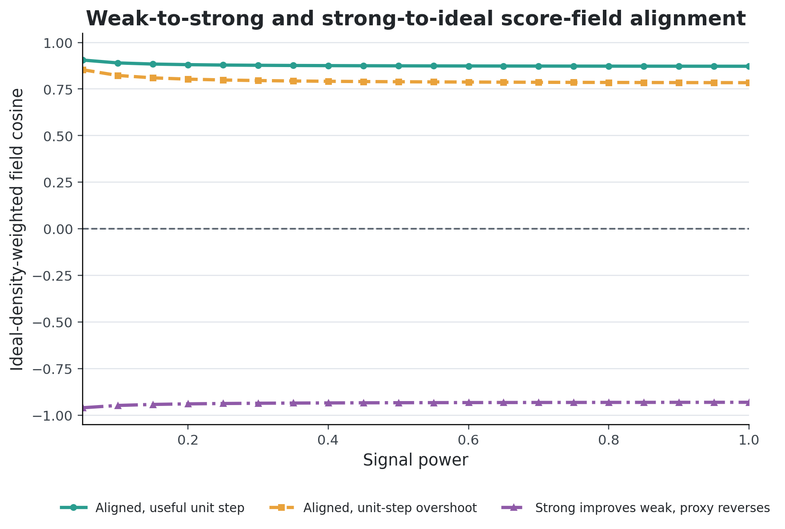
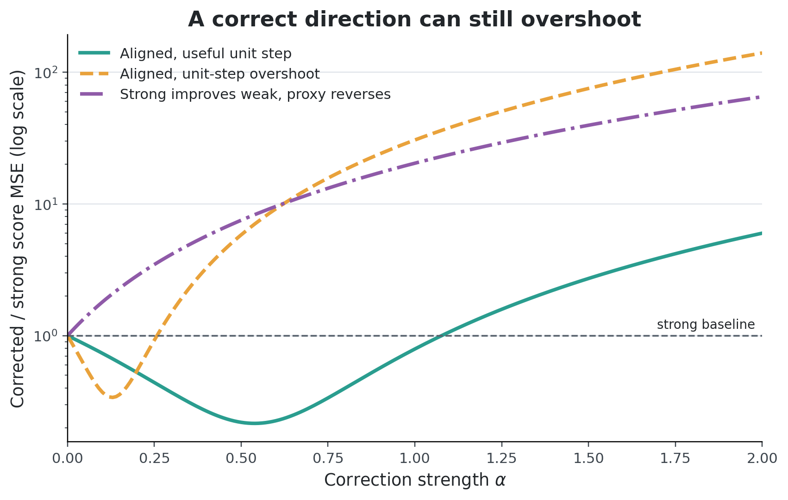
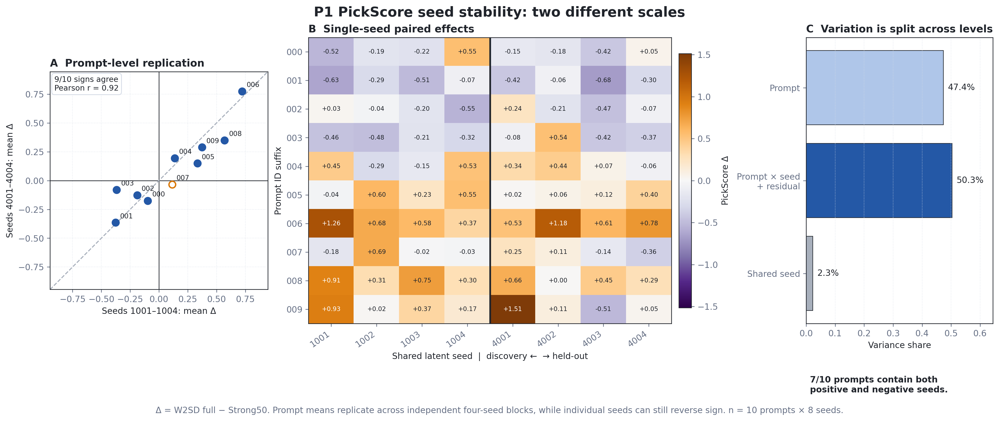
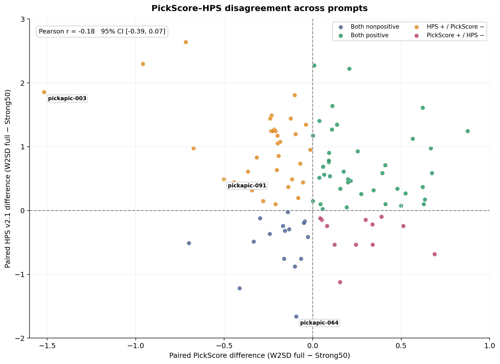

## It all starts with the correction we cannot observe

I started reading [Weak-to-Strong Diffusion with Reflection (W2SD)](https://arxiv.org/abs/2502.00473) because its central proposal is simple enough to state in one line: use the difference between a weak model and a strong model to improve the strong model again.

That sounds plausible. It also hides a serious assumption.

At diffusion time $t$, let a model estimate a score field

$$
s_\theta(x_t,t)=\nabla_{x_t}\log p_t^\theta(x_t).
$$

Roughly, the score points toward states that the model considers more likely. Suppose the strong model has score $s_s$, while an ideal model has score $s_*$. The correction we want is

$$
\Delta_2=s_*-s_s.
$$

If we knew $\Delta_2$, the problem would already be solved. In practice, $s_*$ is unavailable. We can introduce a weak model with score $s_w$ and measure

$$
\Delta_1=s_s-s_w.
$$

W2SD treats this observable difference as a proxy for the missing one:

$$
\boxed{\Delta_1\approx\Delta_2.}
$$

In plain language, it continues in the direction that took us from weak to strong and hopes that the same direction also leads from strong toward ideal. That hope is testable. A better strong model does not automatically give us a useful difference vector.

For a conceptual proxy-score update

$$
s_{\mathrm{new}}=s_s+\alpha\Delta_1,
$$

the local squared score error decreases only when

$$
0<\alpha<\frac{2\Delta_1^\top\Delta_2}{\lVert\Delta_1\rVert^2}.
$$

Two things have to go right. The weak-to-strong difference must point at least partly toward the ideal correction, and the step must be small enough not to overshoot. The coefficient $\alpha$ is an analytic correction strength. It is not a direct identification of the reflection strength inside the full sampler.

This gave me two questions. Is the observed direction geometrically useful when the ideal score is known? If it is, does reflection produce a consistent improvement in an actual diffusion pipeline?

## How reflection extracts the difference

W2SD produces the correction through a round trip in diffusion time. Starting from $x_t$, the strong model performs one denoising step. The weak model then inverts that step back to the original noise level:

$$
x_t
\xrightarrow{\text{strong denoising}}
x_{t-\Delta t}
\xrightarrow{\text{weak inversion}}
\widetilde{x}_t.
$$

If the same model performed both operations and inversion were exact, the round trip would return to $x_t$. Using two models leaves a residual:

$$
\widetilde{x}_t-x_t
\approx
\sigma_t^2\Delta t(s_s-s_w)
=\sigma_t^2\Delta t\,\Delta_1.
$$

This residual is the reflection update. The strong model then continues ordinary denoising from the shifted latent. I use "reflection" here to mean this cross-model denoise and inversion residual.

## A direct test where the ideal score is known

In SDXL, $\Delta_2$ remains unobserved because the ideal image distribution is unknown. Learned image metrics measure the consequences of reflection. I therefore started with a setting where every score can be computed exactly.

I used a one-dimensional mixture of two Gaussians centered at $-4$ and $4$. A scalar $\pi$ controls the probability of the left mode:

$$
p_\pi(x)=\pi\,\mathcal N(x;-4,0.8^2)+(1-\pi)\,\mathcal N(x;4,0.8^2).
$$

By choosing different values of $\pi$ for the weak, strong, and ideal distributions, I can calculate $\Delta_1$, $\Delta_2$, their alignment, and the score error after applying a correction. The calculation integrates over the data coordinate and over twenty noise levels.

I constructed three cases. The first gives the hypothesis an easy win. The other two keep one part of the intuition while breaking another.

| Case | Left-mode weights $(\pi_w,\pi_s,\pi_*)$ | Field cosine | Best $\alpha$ | $E(1)/E(0)$ |
|---|---:|---:|---:|---:|
| Aligned and useful | $(0.10,0.30,0.50)$ | $+0.885$ | $0.538$ | $0.792$ |
| Aligned but overshooting | $(0.05,0.40,0.50)$ | $+0.813$ | $0.129$ | $30.554$ |
| Stronger but anti-aligned | $(0.05,0.30,0.20)$ | $-0.943$ | $-0.265$ | $20.362$ |

Here, $E(\alpha)$ is the ideal-score error after applying $\alpha\Delta_1$. A ratio below one means that the correction helped.

The first case behaves as W2SD hopes. The two differences point in similar directions, and a unit proxy-score correction reduces score error by about 21 percent.

The second case is more revealing. Its cosine is positive, yet setting $\alpha=1$ makes the error more than thirty times larger. The direction is useful, but the safe interval ends at $\alpha=0.258$. This analytic update overshoots badly.

In the third case, the strong model is genuinely closer to the ideal distribution than the weak model. Its score error is only 14.4 percent of the weak model's error. Even so, $\Delta_1$ points away from $\Delta_2$, and every positive proxy step makes the strong model worse.

The first case confirms that the W2SD intuition can work. The next two show why a weak/strong ranking is not enough. Model quality can improve while $\Delta_1$ points away from $\Delta_2$. Even with positive alignment, the correction can be too large.

## Taking the same question to SDXL

The Gaussian mixture lets me inspect both difference fields, but it leaves open whether the issue matters in a real image model. I next used the source configuration built around SDXL. Ordinary sampling uses LoRA at scale 0.8 and CFG 5.5.

W2SD keeps that path for generation and inserts a reflection loop between two LoRA settings of the same model. The denoising leg uses scale 0.8. The inversion leg uses scale -1.5. Both legs run at CFG 1.0, so the residual comes from the gap between those two settings inside a shared trajectory. Base SDXL remains a visual reference outside this loop.

For each image pair, I start both sampling paths from the same saved latent. They see the same initial noise and begin to diverge only after the sampling procedures split.

## The source result depends on the evaluator

The first experiment follows the available source configuration closely. It compares W2SD with the ordinary strong baseline on 100 prompts, with one seed per prompt.

| Metric | W2SD minus strong baseline | 95% prompt-bootstrap interval | Prompt win rate |
|---|---:|---:|---:|
| HPS v2.1 | $+0.4778$ | $[+0.3149,+0.6359]$ | 72% |
| PickScore | $+0.0186$ | $[-0.0537,+0.0882]$ | 52% |
| Aesthetic score | $+0.1654$ | $[+0.1184,+0.2135]$ | 79% |

The result is not a clean three-metric win. HPS and the aesthetic score show clear positive shifts. PickScore stays close to zero: its interval crosses zero and its prompt win rate is 52 percent.

I label this a partial, directional reproduction. Exact numerical reproduction would require the historical metric revisions, preprocessing, checkpoint record, and seed mapping, which are incomplete in the public artifacts.

W2SD also increased RGB clipping from 0.0268 percent to 1.1791 percent, along with saturation and contrast. Reflection plainly changed the generated distribution. Whether that change counts as a general quality improvement depends on what the evaluator rewards.

## Why PickScore barely moved

Outlier diagnostics leave the PickScore result almost unchanged. Across the 100 prompts, the mean change is $+0.0186$, the median is $+0.0053$, and the 10 percent trimmed mean is $+0.0250$. Removing any one prompt leaves the mean between $+0.0099$ and $+0.0341$.

The positive and negative changes are simply mixed. This ruled out the easiest explanation: one spectacular failure did not drag the mean down.

Seed variation gave me a second possible explanation. On the first ten prompts with four shared seeds, only five kept the same nonzero PickScore sign in all four runs. Perhaps the weak aggregate result was just an unlucky seed block.

I fixed four new seeds before generation and reran the same ten prompts. The discovery and held-out blocks preserved the prompt-level mean sign for 9 of 10 prompts. Their PickScore effects had Pearson correlation $0.92$ and Spearman correlation $0.94$. The prompt pattern survived.

The individual images tell a messier story. Seven of the ten prompts contained both positive and negative seed outcomes across the eight runs. A single image can reverse the apparent winner even when the prompt-level average is repeatable.

This changed my diagnosis. The weak aggregate PickScore result is not well explained by one bad seed choice. It looks more like reproducible prompt-level heterogeneity with substantial variation from one generated image to the next.

The metrics also disagree on individual prompts. HPS and PickScore are both positive for 40 prompts, but they point in opposite directions for 44. Their observed Pearson correlation is $-0.180$ and their Spearman correlation is $-0.119$; both uncertainty intervals cross zero.

HPS and PickScore were trained on different preference data and objectives. Their disagreement leaves the human-preference effect unresolved. This experiment establishes metric disagreement, not metric failure. A blinded human comparison could tell us which score, if either, tracks the judgments we care about.

## So what exactly is weak/strong?

### Did we take these two terms too literally?

Before running these experiments, I read "weak" and "strong" quite literally. I imagined two models at different stages of the same improvement path. The gap between them would then reveal where the strong model should move next. That picture is intuitive, and the one-dimensional example in the paper makes it easy to believe.

The LoRA experiment made the word "weak" feel less literal. The reflection loop compares LoRA scale $0.8$ with scale $-1.5$. If the score is locally close to linear in the LoRA scale $a$,

$$
s(a)\approx s_0+a\,d_{\mathrm{LoRA}},
$$

then the difference used by reflection is approximately

$$
s(0.8)-s(-1.5)\approx2.3\,d_{\mathrm{LoRA}}.
$$

> I found it more useful to think of them as contrast models.

Under this approximation, the second model acts like a contrast model that exposes the adapter direction. Reflection then uses that contrast to steer the latent. The approximation needs direct testing, since the UNet response may be nonlinear and the two branches visit slightly different states. Still, it gives a more concrete account of what the method may be doing in this particular setup.

The Gaussian-mixture cases changed another part of my interpretation. A quality ranking tells us which model is closer to the target. It says little about the direction formed by subtracting their score fields. In the anti-aligned case, the strong model has much lower ideal-score error than the weak model, yet the weak-to-strong difference points away from the remaining correction. In the overshoot case, the direction is broadly correct and the unit update still makes the error much larger.

This separates model quality from direction quality. W2SD needs a pair whose difference reveals the strong model's remaining error. It also needs a suitable correction strength. Calling one model weak and the other strong leaves both questions unanswered.

The strong model keeps the same parameters throughout generation. Reflection changes the sampler by moving the current latent, and the rest of the trajectory unfolds from that new point. I now describe the mechanism as inference-time score extrapolation.

### And what exactly is "ideal" in T2I?

The word "ideal" becomes harder to pin down in text-to-image generation. A prompt admits many valid images, and HPS, PickScore, and the aesthetic predictor were trained from different signals. In the source-protocol run, HPS and aesthetic score improved clearly while PickScore stayed close to zero. Their prompt-level disagreements suggest that the correction is moving toward some evaluator preferences more reliably than others. The simultaneous increase in clipping, saturation, and contrast adds another possibility: reflection may amplify visual features that some reward models favor.

This leaves a selection problem. To use W2SD reliably, we need to choose a useful contrast model and set the correction strength before seeing the outputs. Right now, the clearest evidence about those choices arrives after generation, when we compare reward scores. The unavailable ideal correction has partly returned through model-pair selection and evaluation.

I now think of W2SD as a conditional inference-time extrapolation method. Under the source configuration, reflection produced positive HPS and aesthetic shifts, while PickScore stayed close to zero. The analytic cases explain why the same construction can also overshoot or point the wrong way. What I want to know next is whether direction quality can be predicted before sampling, perhaps from trajectory-level measurements or a controlled correction-strength test.

## Where this leaves me

This remains a partial reproduction. The source run covers 100 prompts with one seed each. The seed experiment is deeper but narrower: ten prompts with eight shared seeds. It answers the seed-block question for that panel, not for the full prompt population. Formal human evaluation is still missing.

A blinded A/B comparison is now the most direct check on the metric disagreement. I would ask separately about prompt adherence, overall visual preference, and visible artifacts. A correction-strength sweep would connect the SDXL experiment to the analytic overshoot case.

The answer to the title is conditional. W2SD helps when the chosen model contrast exposes part of the strong model's remaining error and the effective correction does not overshoot. In this SDXL run, the change was reproducible enough to survive outlier checks and a held-out seed block, but the evaluators did not agree on whether it was better. That last part still needs people.

## References

- Lichen Bai, Masashi Sugiyama, and Zeke Xie. [Weak-to-Strong Diffusion with Reflection](https://arxiv.org/abs/2502.00473).
- Yuval Kirstain et al. [Pick-a-Pic: An Open Dataset of User Preferences for Text-to-Image Generation](https://arxiv.org/abs/2305.01569).
- Xiaoshi Wu et al. [Human Preference Score v2: A Solid Benchmark for Evaluating Human Preferences of Text-to-Image Synthesis](https://arxiv.org/abs/2306.09341).
