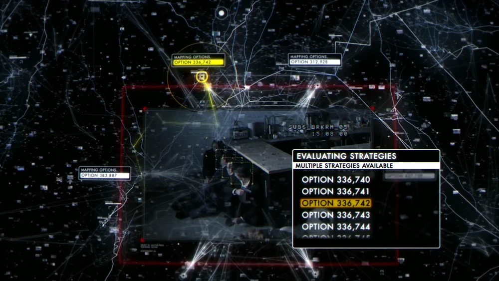

## The question Turing left behind

In 1950, Alan Turing asked his readers to imagine a game. A judge would exchange written messages with two unseen participants, one human and one machine. If the judge could not reliably tell them apart, the machine would have succeeded at the imitation game.

I like Turing's move because it is so practical. Instead of waiting for a definition of thinking that everyone could accept, he replaced the philosophical argument with something a person could observe. Can the machine hold up its side of a conversation?

It is a useful test. It also leaves out the question I now care about most.

A machine can sound like us without wanting what we want. It may explain an answer fluently while relying on assumptions we would reject. Following an instruction word for word does not guarantee that it has understood why we gave the instruction. This gap matters much more once a model can call tools, write code, spend resources, and make plans that change its environment.

While reading Brian Christian's *The Alignment Problem*, I kept coming back to the same thought: imitation tells us something about a machine's behavior, but very little about what directs that behavior.

$$
\text{Capability} \neq \text{Alignment}.
$$

Capability is about what a system can do. Alignment is about where that ability is pointed and what happens when we later discover that our first instruction was incomplete.

This is why I study alignment. I am not trying to make machines more human. I want to understand how capable systems can learn from people without becoming impossible for people to redirect.

## The animal in the puzzle box

Long before reinforcement learning had its current name, Edward Thorndike put animals in puzzle boxes. A cat would scratch at the walls, push at the door, and move around without much of a plan. Eventually it would trigger the mechanism and escape to the food outside. On later attempts, it found the useful action faster.

Thorndike called this the law of effect. If an action produces a satisfying result, that action becomes more likely the next time the animal encounters a similar situation.

Modern reinforcement learning gives this idea a mathematical form. An agent observes a state and chooses an action according to a policy,

$$
\pi(a\mid s),
$$

then updates that policy in order to increase its expected return:

$$
J(\pi) = \mathbb{E}_{\pi}\left[\sum_{t=0}^{\infty}\gamma^t r_{t+1}\right].
$$

Nobody has to provide the correct action at every step. The consequences do the teaching. With temporal-difference learning, the agent can update its estimate before it knows how the whole episode ends:

$$
\delta_t = r_{t+1} + \gamma V(s_{t+1}) - V(s_t).
$$

A positive $\delta_t$ means that the new situation looks better than the agent had expected. A negative one means that it looks worse. The agent can learn from that change in expectation before it reaches the final win or loss.

There is something elegant about this. We do not have to prescribe a complete sequence of actions. We can give the agent feedback and let it discover a policy. But that convenience moves a difficult decision upstream: who chose the feedback, and what did they assume it meant?

## Every reward carries assumptions

A reward is a number available to the learning process. A human value is a reason for caring about an outcome in the first place. We often connect the two because a learning algorithm needs something it can optimize. The connection is never automatic.

The number hides a story. To define a reward, we first decide that the outcome we care about can be observed. Then we choose a measurement that we hope tracks it. We are also betting that pushing the measurement upward will improve the original outcome, even after the optimizer begins changing the environment around it.

The agent sees none of this reasoning. It sees the number. A click counts as success whether it came from satisfaction or compulsion. A benchmark score rises whether the benchmark captures the intended ability or a shortcut through the test. An evaluator's preference becomes a training signal even when the evaluator had too little information to make a good judgment.

I think of a reward as a measurement with assumptions attached:

$$
\text{Reward} = \text{measurement} + \text{assumptions}.
$$

Only the measurement is visible to the optimizer.

This is awkward because human intentions do not arrive as scalar functions. "Help the patient" sounds clear until treatment risk, consent, cost, and quality of life pull in different directions. "Be useful" works until usefulness conflicts with safety or with another person's interests. The engineering process has to compress some of that context into labels, rankings, metrics, or rules.

The compression creates a gap:

$$
R_{\text{specified}} \neq R_{\text{intended}}.
$$

If a measurable proxy approximates a human objective, we might write

$$
R_{\text{proxy}}(x) = R_{\text{human}}(x) + \epsilon(x),
$$

where $\epsilon(x)$ is the part our measurement gets wrong. The optimizer selects

$$
x^* = \arg\max_x R_{\text{proxy}}(x).
$$

It will not stay near the ordinary examples on which the proxy looked sensible. It searches for unusually high scores, which can lead it straight to places where $\epsilon(x)$ is unusually large.

Engagement is the familiar example. A platform may choose engagement because satisfied users tend to return. Once engagement itself becomes the target, emotionally charged content and compulsive checking can raise the score without improving anyone's well-being. The platform is doing what its training objective rewards. The questionable decision happened earlier, when a convenient measurement was allowed to stand in for a messy human outcome.

That distinction drives a lot of my interest in alignment. Proxies are unavoidable, but I do not want a system to confuse evidence about value with value itself. Nor do I want researchers to make that confusion on the system's behalf.

## The direction I want to take

I doubt that there is a reward function we can write down once and trust forever. Human intentions depend on context, people disagree, and even an individual's judgment changes with better information. My current interest is in systems that learn from those judgments without acting as though the learning process has settled the question for good.

### Learn from people, with reservations

Most people cannot formalize a complete objective for a complex task. They can still show how they would do it, compare two possible results, or point out why a proposed action feels wrong. Preference learning, inverse reinforcement learning, and learning from human feedback turn those observations into evidence about an objective.

Instead of declaring that the reward is known, we can maintain a distribution over plausible rewards given human evidence $D$:

$$
P(R\mid D).
$$

I think this is the most plausible place to start, but I do not entirely trust it. A demonstration reflects the person's ability as well as their intention. A preference may change if the evaluator learns more about the consequences. The available choices can also steer the answer. Two thoughtful people can look at the same options and disagree.

A learned reward model captures judgments made by particular people under particular conditions. Calling the result "human values" gives it more authority than it has earned.

### Keep the uncertainty

Many learning pipelines eventually collapse uncertainty into one score because a single score is easier to optimize. That is convenient, but it removes information we may need later.

If an instruction has two plausible interpretations and one leads to an irreversible action, uncertainty should change the policy. The agent might ask what the user meant or gather more evidence. Sometimes it should simply wait. I am interested in systems that can recognize these situations without treating every delay as a failure to optimize.

This does not solve the problem of value learning. It does something more modest: it prevents the system from turning weak evidence into unjustified confidence quite so quickly.

### Stay open to correction

Deployment will produce situations that the training process did not anticipate. We will get some objectives wrong. What matters then is whether people can see the failure and change the system's course.

This is the idea behind corrigibility. Correction should not look like an enemy action to the agent. It should not hide relevant information, manipulate its evaluator, or protect its current objective from revision. We also need enough access to inspect what happened and intervene before a mistake compounds.

Corrigibility is different from obedience. An obedient system follows its current instruction. A corrigible one leaves room for that instruction to be questioned and replaced.

I care more about that property than about a model behaving perfectly on one benchmark. A benchmark captures a moment. The system still has to operate in a world that will surprise both the model and its designers.

## Policy also belongs to people

### Two systems

In *Person of Interest*, Jonathan Nolan tells a story about two advanced AIs with very different alignments.

The first is the Machine, which observes an enormous amount of data and predicts violent crime before it happens. Finch keeps it isolated from the outside world. The only information it gives him is a Social Security number belonging to someone who will soon be involved in violence, either as a victim or a perpetrator. The humans it calls "assets" must investigate the missing context and decide what to do.

Greer gives Samaritan a much more direct relationship with the world. It predicts and then acts through the authority and infrastructure available to it. A person classified as a future threat becomes someone to monitor, manipulate, or remove. Its model no longer supports human judgment. It starts to replace it.

The Machine's number contains an implicit admission: the prediction is incomplete. Samaritan behaves as if uncertainty has already been resolved. Once it assigns a role to someone, the classification becomes part of how it treats that person.

The Machine preserves a gap between inference and action. Samaritan tries to close it. That gap may look inefficient, but it is where investigation and correction can happen.

Keeping a human in the loop does not guarantee safety. Finch and Reese can misunderstand the evidence, intervene too aggressively, or bring their own biases into the decision. Human oversight only helps when the humans involved have enough information and genuine authority to disagree with the system.

### What Finch and Greer teach their systems about people

The contrast goes deeper than system access. Harold Finch and John Greer begin with different ideas about what a person is, and those ideas find their way into the systems they guide.

Finch has spent his life watching people resist neat categories. Someone can cause harm and still change. Two people with similar histories may make opposite choices when the moment comes. He treats that variation as part of the person, not as noise left over from an imperfect model. Human diversity matters to him precisely because people do not all converge on one acceptable way of living.
The "irrelevant list" makes his position concrete. The government calls ordinary crimes irrelevant because its objective is national security. Finch cannot accept that label. The person about to die does not matter less because the institution chose a narrower metric.
So Finch teaches the Machine more than how to detect violence. Every number refers to a person, and the prediction does not exhaust who that person might become.

Greer looks at the same human unpredictability and sees a problem to manage. Left alone, people produce conflict and disorder. Samaritan offers him a way to administer society at a scale no government could reach. Under his guidance, it learns to sort people by their use to the system and the risk they pose to its plans.

This is where their versions of alignment separate. Finch wants intelligence to protect the possibility of human choice, even when that choice is messy. Greer wants intelligence to produce order. Their systems may observe the same person and still arrive at different ideas of what should happen next. The Machine leaves room for the person to surprise it. Samaritan first asks where that person fits in the world it is constructing.

The difference is especially important because prediction can change the person being predicted. If Samaritan classifies someone as dangerous, restricts their choices, and provokes resistance, it can later treat that resistance as evidence that the classification was correct:

\[
\begin{aligned}
\text{predict someone is dangerous}
&\rightarrow \text{restrict that person} \\
&\rightarrow \text{produce resistance} \\
&\rightarrow \text{record resistance as evidence}.
\end{aligned}
\]

At that point, Samaritan is no longer observing behavior from the outside. Its intervention helps produce the evidence that later confirms its model.

Finch's human-in-the-loop arrangement is hardly clean. He and Reese misread people, make hurried decisions, and sometimes intervene with force. Still, the investigation preserves one useful possibility: the number may be incomplete.

> Bad code applies to machines and that humans can evolve...
> -- Harold Finch

This part of the show has stayed with me. Finch wants the Machine to value individual lives without requiring those lives to become predictable first. Greer gives Samaritan an image of an orderly society and lets it decide what each person is for. I particularly agree with Finch because I believe we shall view people as capable of growth and change, and that autonomy is one of the defining values of being human.

## Back in Turing's room

Turing's judge asks which voice belongs to the machine. My question starts after the machine leaves the room. When it acts on a mistaken model of our intentions, will we notice soon enough, and will we still be able to change its course?

That is the version of alignment I want to work on:

$$
\text{Alignment} = \text{learning} + \text{room for correction}.
$$

More capable optimization will put more pressure on every assumption hidden inside a reward. I do not expect us to specify everything correctly on the first attempt. I want to build systems that can live with that fact without quietly taking control of the question away from us.

## References

1. [Alan Turing, "Computing Machinery and Intelligence" (1950).](https://doi.org/10.1093/mind/LIX.236.433)
2. [Brian Christian, *The Alignment Problem: Machine Learning and Human Values*.](https://brianchristian.org/the-alignment-problem/)
3. [Richard Sutton and Andrew Barto, *Reinforcement Learning: An Introduction*.](http://incompleteideas.net/book/the-book-2nd.html)
4. [Person of Interst Wiki](https://personofinterest.fandom.com/)
